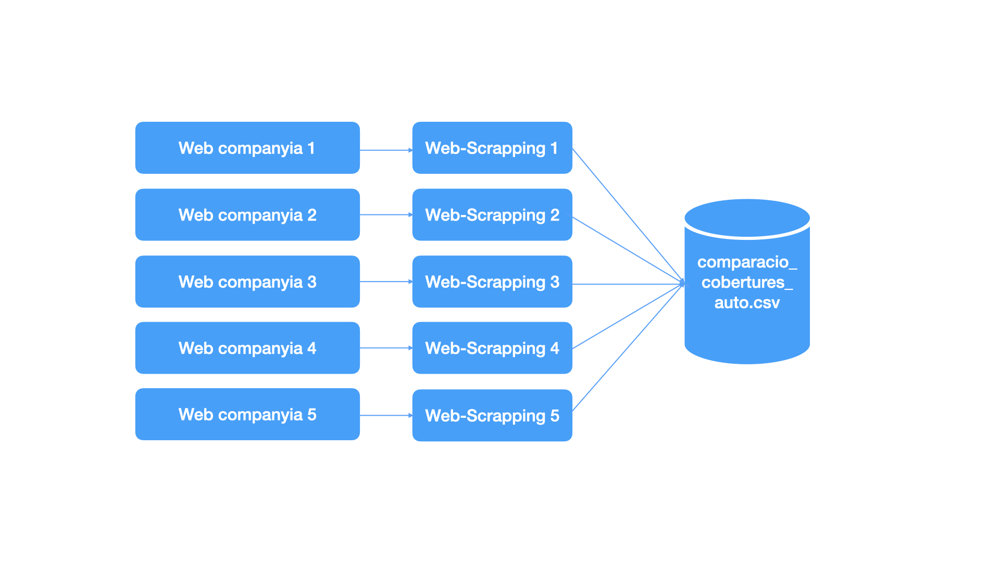

# Documentació de la pràctica

## 1. Context

En el context del món assegurador, pel bon disseny d'un producte 
és molt important conèixer el tipus de cobertures que ofereix la 
competència, ja que aquestes poden ser força heterogènies. Per tal, 
no només cal competir en preus per captar clients sinó també
és necessari fer una comparativa ràpida entre les cobertures 
ofertes en el mercat, que poden canviar ràpidament en funció
de les circumstàncies (e.g. COVID-19)

L'objectiu d'aquest projecte és desenvolupar un codi de web-scrapping 
que recopili les cobertures ofertes per diferents companyies 
asseguradores per un producte assegurador d'automòbil, consultant
a la pàgina web de cada entitat. A continuació es faciliten algunes
de les pàgines utilitzades com a font per a alimentar el dataset:

- [Zurich](https://www.zurich.es/seguros-coche/comparador)
- [Mapfre](https://www.mapfre.es/seguros/particulares/coche/seguros-de-coche/)
- [Allianz](https://www.allianz.es/seguro-de-coche.html#coberturas)

## 2. Títol del dataset

En funció del context aportat a l'apartat anterior, 
el títol serà el següent:

> comparacio_cobertures_auto.csv

## 3. Descripció del dataset

El dataset conté informació sobre diferents cobertures i garanties
que cobreix cada paquet d'assegurances d'automòbil ofert per 
cada companyia d'assegurances

## 4. Representació gràfica

## 5. Continguts

El dataset conté informació de les cobertures d'auto extretes 
a una determinada data. La informació s'ha recollit executant
un script de Python on es realitza webscrapping sobre les
webs esmentades en l'apartat 1. 

Els camps del dataset són els següents:

| Nom       | Format | Descripció                       |
|-----------|--------|----------------------------------| 
| data      | Date   | Dia d'extracció de la informació |
| companyia | String | Nom de la companyia              |
| producte  | String | Autos                            |
| paquet    | String | Tipus de paquet del producte     |
| garantia  | String | Tipus de garantia del producte   |
| cobertura | String | Descripció del grau de cobertura |

## 6. Agraïments

Agraïm a les diferents webs des d'on hem extret la info:

- [Catalana Occident](https://www.seguroscatalanaoccidente.com/seguros-coche-comparativa)
- [Direct Seguros](https://www.directseguros.es/seguros-de-coche/seguro-comparativa.html)
- [MMT Seguros](https://www.mmtseguros.com/seguros-coche/comparador-seguros-coche/)
- [RACC](https://www.racc.es/seguro-coche/)
- [Seguros Bilbao](https://www.segurosbilbao.com/seguros-coche/comparativa)

## 7. Inspiració

## 8. Llicència

Escollim *Released Under CC0: Public Domain License*, donat que es 
tracta d'un projecte de software lliure on qualsevol persona pot contribuir 
o fer ús del mateix sense restriccions. 

## 9. Codi

El codi es troba en el següent repositori de 
[GitHub](https://github.com/jmirfern/data-lifecycle-pr1/tree/feature/%239-code-replica)

## 10. Dataset link
El dataset generat es pot descarregar des 
de [Zenodo](https://zenodo.org/record/6385595#.Yj4fiy8rxhE)

## 11. Video link

< Pending >

